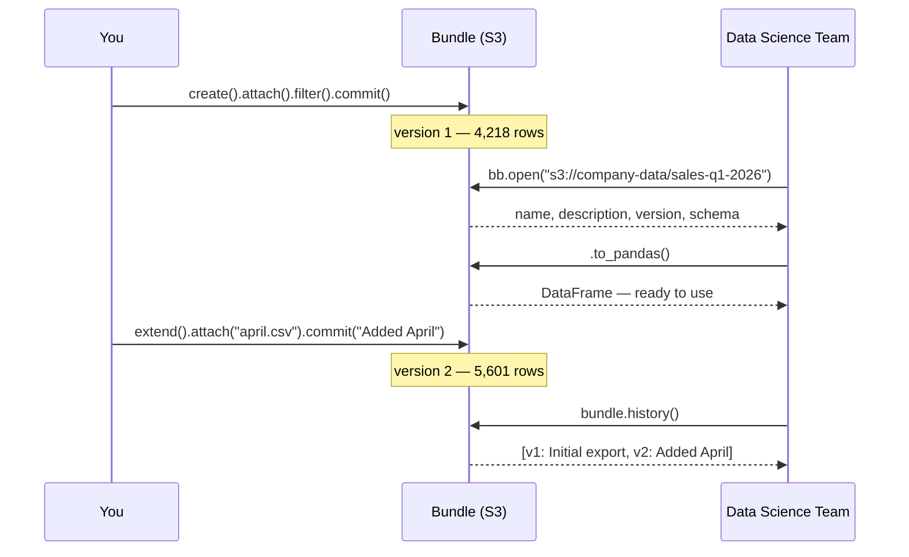
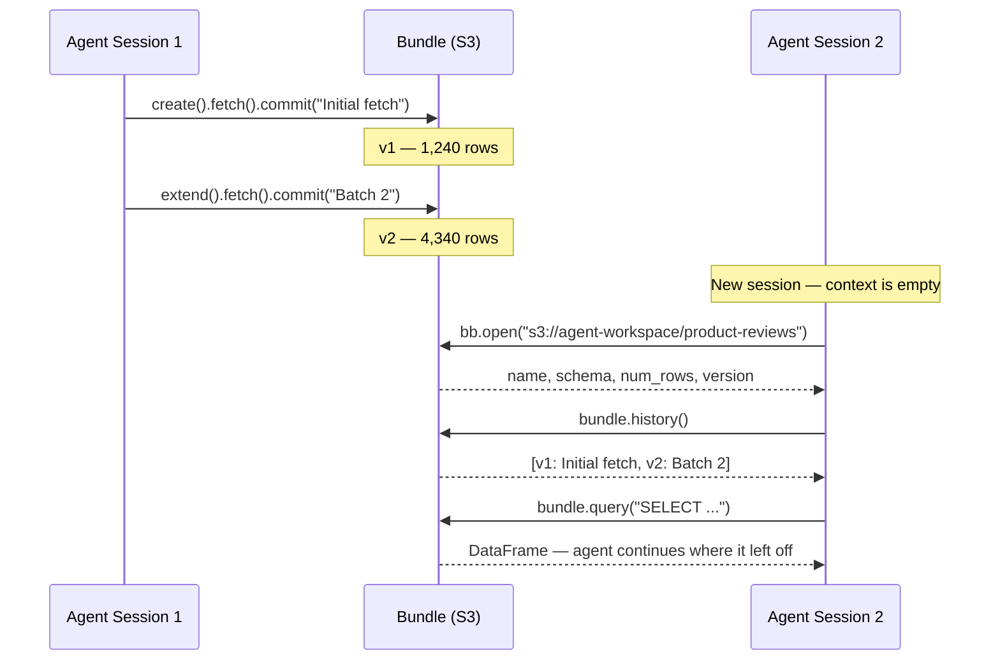

# Why Bundlebase?

If you know Docker: the mental model is the same — the artifact carries its own context, opening the bundle is the pull, and consumers don't need to know how it was built — whether they're using Python, the CLI, a BI tool, or an AI assistant. Whether that fits your situation is what this page covers.

## The problem with plain files

Plain files on S3 or a shared drive are the default, and they work fine — until they don't. Here's where they fall apart:

**Schema is implicit.** A Parquet file carries column names and types, which helps. A CSV carries nothing. Either way, there's no "what does this data represent" attached to the file. The consumer has to read a README, ask the person who made it, or just guess.

**No transformation record.** Did someone filter this to only include active customers? Remove a PII column? Rename fields from the source? That history lives in a script somewhere, or in nobody's head. Six months later, nobody's sure what the file actually contains.

**No version tracking.** "Use the latest file" is fine until there are three files with dates in the name and you're not sure which one the Q3 analysis used.

**Re-read cost every time.** No indexing, no pushdown. Every query reads the whole file.

Bundlebase's answer: bundle the data, transformation record, commit history, and schema into a single thing that lives at a path.

---

## Use case 1: Shareable analytics datasets

### The scenario

You have a quarterly sales export from your CRM — three CSVs with inconsistent column names, a few PII fields you need to strip, and a filter to apply (closed-won deals only). You want the data science team to work from a clean, stable version of this. You also want to update it monthly and have a clear changelog.

### How you'd do it

=== "Python"

    ```python
    import bundlebase.sync as bb

    bundle = (bb.create("s3://company-data/sales-q1-2026")
        .attach("s3://crm-exports/q1/january.csv")
        .attach("s3://crm-exports/q1/february.csv")
        .attach("s3://crm-exports/q1/march.csv")
        .normalize_column_names()          # fixes inconsistent casing, special chars
        .drop_column("ssn")
        .drop_column("email")
        .filter("status = 'closed_won'")
        .set_name("Q1 2026 Sales — Closed Won")
        .set_description("CRM export, PII removed, normalized column names"))

    bundle.commit("Initial Q1 2026 export")
    ```

=== "SQL"

    ```sql
    ATTACH 's3://crm-exports/q1/january.csv';
    ATTACH 's3://crm-exports/q1/february.csv';
    ATTACH 's3://crm-exports/q1/march.csv';
    NORMALIZE COLUMN NAMES;
    DROP COLUMN ssn;
    DROP COLUMN email;
    FILTER WITH SELECT * FROM bundle WHERE status = 'closed_won';
    COMMIT 'Initial Q1 2026 export';
    ```

The data science team uses it like this:

=== "Python"

    ```python
    import bundlebase.sync as bb

    bundle = bb.open("s3://company-data/sales-q1-2026")
    print(bundle.name)           # "Q1 2026 Sales — Closed Won"
    print(bundle.description)    # what's in it and how it was prepared
    print(bundle.version)        # which commit they're on

    df = bundle.to_pandas()
    revenue_by_region = bundle.query(
        "SELECT region, SUM(amount) FROM bundle GROUP BY region"
    ).to_pandas()
    ```

=== "SQL"

    ```sql
    OPEN 's3://company-data/sales-q1-2026';
    SHOW STATUS;  -- name, description, version

    SELECT region, SUM(amount) FROM bundle GROUP BY region;
    ```

When you update next month, commit with a message explaining what changed. The consumer can call `bundle.history()` to see the changelog without asking you.

### The handoff flow



### How it compares to alternatives

#### vs. Raw Parquet or CSV files on S3

Raw files are the right default for one-off work. The gap shows up when: the schema changes silently between updates, you can't tell which version an analysis used, or a new team member has to read a README to figure out what's in the file.

| | Raw files | Bundlebase |
|---|---|---|
| Setup | None | None |
| Schema documentation | Manual | Self-describing |
| Version history | None (or `_v2` in filename) | Built-in commits |
| Transformation record | Separate script | Stored in manifest |
| SQL queries | Requires separate tool | Built-in |
| Indexing | None | Optional |

**When to keep using raw files:** one-off exports, single consumer, small files, no need for history, or you control both sides of the pipeline and change nothing.

#### vs. DVC (Data Version Control)

DVC versions data alongside code in Git. It's a good fit if you're tracking ML experiments and want data versions tied to specific model training runs. It's less well-suited for sharing data with people who don't have your Git repo or your DVC remote configured.

| | DVC | Bundlebase |
|---|---|---|
| Requires Git repo | Yes | No |
| Consumer setup | `dvc pull` + DVC installed | `bb.open()` |
| Python query API | Limited | First-class |
| SQL queries | No | Built-in |
| ML pipeline tracking | Yes | No |
| Self-describing | No | Yes |

**When to use DVC instead:** you're tracking ML training runs and want data versions pinned to code commits, your team already uses DVC, you want data versioning integrated with your CI pipeline.

#### vs. Delta Lake / Apache Iceberg

Delta Lake and Iceberg solve table format problems at warehouse scale: concurrent writes, schema evolution, time travel, ACID transactions. They're genuinely good at these things. They also require Spark or Trino-class infrastructure and significant setup.

| | Delta / Iceberg | Bundlebase |
|---|---|---|
| Infrastructure | Spark / Trino / Athena | None (Python library) |
| Concurrent writes | Yes (ACID) | No |
| Scale | Petabytes | Up to ~100GB comfortably |
| Time travel | Yes | Commit history (read past versions) |
| pandas/polars | Via connectors | Direct |
| Setup | Significant | `pip install bundlebase` |

**When to use Delta/Iceberg instead:** you're building a production data platform, you need concurrent writes from multiple processes, you're already running Spark, or your dataset is too large for a single machine.

#### vs. PostgreSQL / SQLite

A database is right when you need concurrent writes, long-lived operational storage, or row-level access control. For read-heavy analytical sharing, you're adding a server process, connection management, and import/export steps that Bundlebase skips entirely.

| | PostgreSQL / SQLite | Bundlebase |
|---|---|---|
| Concurrent writes | Yes | No |
| Server required | Yes / No (SQLite) | No |
| Data portability | SQL dump | Single directory / S3 path |
| Schema migrations | Yes (alembic, etc.) | No |
| Full SQL | Yes | DataFusion SQL |
| pandas integration | Via SQLAlchemy | Direct |

**When to use a database instead:** write-heavy workloads, row-level permissions, long-running operational storage, or you're building an application backend.

---

## Use case 2: Data storage for LLM agents

### The scenario

An agent is doing automated data analysis — scraping product reviews from an API, processing them, building up a dataset over multiple sessions. Between sessions, context resets. The agent needs to answer: what data do I already have? Where did it come from? What was the last thing I did?

Without durable, self-describing storage, the agent either re-fetches everything or relies on a sidecar file it wrote itself (which may be stale, incomplete, or missing entirely if the previous session crashed).

### How you'd do it

In each session, the agent updates the bundle:

=== "Python"

    ```python
    import bundlebase.sync as bb

    bundle = (bb.open("s3://agent-workspace/product-reviews").extend()
        .create_source("http", {
            "url": "https://api.example.com/reviews",
            "json_record_path": "data"
        })
        .fetch("base", "add")
        .set_description("Product reviews from example.com API"))

    bundle.commit(f"Fetched batch {batch_id} — {new_rows} new reviews")
    ```

=== "SQL"

    ```sql
    OPEN 's3://agent-workspace/product-reviews';
    CREATE SOURCE http 'https://api.example.com/reviews'
      json_record_path=data;
    FETCH base ADD;
    COMMIT 'Fetched batch 3 — 2,840 new reviews';
    ```

At the start of the next session, the agent reconstructs its context from the bundle:

=== "Python"

    ```python
    import bundlebase.sync as bb

    bundle = bb.open("s3://agent-workspace/product-reviews")

    # What do I have?
    print(bundle.name)           # "Product Reviews"
    print(bundle.num_rows)       # 14,302
    print(bundle.schema)         # column names and types

    # What happened last time?
    for entry in bundle.history():
        print(entry)
    # → v1: Initial fetch — 1,240 reviews
    # → v2: Fetched batch 2 — 3,100 new reviews
    # → v3: Fetched batch 3 — 2,840 new reviews

    # Query without loading everything
    recent = bundle.query(
        "SELECT * FROM bundle WHERE review_date >= '2026-01-01'"
    ).to_pandas()
    ```

=== "SQL"

    ```sql
    OPEN 's3://agent-workspace/product-reviews';
    SHOW STATUS;   -- name, rows, schema, version
    SHOW HISTORY;

    -- v1: Initial fetch — 1,240 reviews
    -- v2: Fetched batch 2 — 3,100 new reviews
    -- v3: Fetched batch 3 — 2,840 new reviews

    SELECT * FROM bundle WHERE review_date >= '2026-01-01';
    ```

### Why this works for agents

The manifest file stored with each commit is machine-readable and carries the full provenance:

```yaml
author: agent-process
message: Fetched batch 3 — 2,840 new reviews
timestamp: 2026-03-15T14:22:09Z
changes:
  - description: Attach https://api.example.com/reviews
    operations:
      - type: attachBlock
        source: https://api.example.com/reviews
        version: 3f4a8b2-7d19c45e8ab21-2840
```

Three specific things this enables:

- **Source provenance without a catalog.** The manifest stores the exact source URL and content hash for every attached file. The agent doesn't need an external system to answer "where did this come from."
- **Machine-readable changelog.** `bundle.history()` returns structured entries. The agent can check whether data has changed since the last session without re-downloading anything.
- **Structural metadata without a full scan.** `bundle.num_rows` and `bundle.schema` are cheap property reads — the agent can understand what it has before deciding whether to query.

### Session flow



### How it compares to alternatives

#### vs. Plain JSON or Parquet files

Plain files are the obvious baseline — just write the fetched data to a file. The capability gap is what's attached. A plain Parquet file has column names and types. A bundle has column names, types, source URL, content hash, transformation history, commit timestamps, and a name/description. An agent working with plain files has to maintain its own sidecar metadata file; with a bundle, the data carries its context.

#### vs. Vector databases

Vector databases (Pinecone, Weaviate, Chroma) solve semantic search over unstructured text: find documents similar to this query by embedding distance. If your agent does retrieval-augmented generation over document chunks, use a vector database — that's what they're built for.

If your agent accumulates structured tabular data (review scores, prices, timestamps, event logs), a vector database is the wrong tool.

| | Vector DB | Bundlebase |
|---|---|---|
| Semantic search | Yes | No |
| Structured tabular data | Awkward | Yes |
| SQL queries | No | Yes |
| Data provenance | No | Yes |
| pandas / polars export | No | Yes |
| Schema + history metadata | No | Yes |

#### vs. Regular databases

A database works well for agents running on a persistent server with a stable connection. For agents that run as ephemeral processes — serverless functions, CI jobs, scheduled scripts — a database requires connection management and usually a separate server process. Bundlebase lives at a path and opens with one call. The trade-off: no concurrent writes, no row-level permissions.

---

---

## Persistent pipeline rules

### The scenario

Your data source is dirty and it stays dirty. Every time you pull a new export, you filter the test accounts, remove negative amounts, and strip the columns that contain PII. You've done this manually for six months. Last quarter, someone ran the pipeline without the filter and the report was wrong.

### How you'd do it

=== "Python"

    ```python
    import bundlebase.sync as bb

    bundle = bb.create("s3://analytics/crm-pipeline")

    # Define cleanup rules once — they fire automatically on every future attach
    bundle.always_delete("WHERE status = 'test'")
    bundle.always_delete("WHERE amount < 0")          # credits tracked separately
    bundle.always_delete("WHERE email IS NULL")

    # Attach the first month's dirty export — rules apply automatically
    bundle.attach("s3://crm-exports/jan.csv")
    bundle.commit("January — rules applied automatically")

    # Next month: extend and attach — same rules fire without you doing anything
    bundle = bb.open("s3://analytics/crm-pipeline").extend()
    bundle.attach("s3://crm-exports/feb.csv")
    bundle.commit("February — rules applied automatically")
    ```

=== "SQL"

    ```sql
    ALWAYS DELETE WHERE status = 'test';
    ALWAYS DELETE WHERE amount < 0;
    ALWAYS DELETE WHERE email IS NULL;

    ATTACH 's3://crm-exports/jan.csv';
    COMMIT 'January — rules applied automatically';

    -- next month
    ATTACH 's3://crm-exports/feb.csv';
    COMMIT 'February — rules applied automatically';
    ```

The rules are stored in the bundle's manifest. Anyone who extends the bundle — a colleague, a scheduled script, a different process — gets the same cleanup applied. You can't accidentally skip it.

### Why this is different from a cleanup script

A cleanup script lives outside the data. It has to be run, remembered, and passed on to whoever takes over the pipeline. `always_delete` and `always_update` rules live *inside* the bundle. The data enforces its own invariants.

=== "Python"

    ```python
    # always_update: transform a column value on every future attach
    bundle.always_update("SET region = 'EMEA' WHERE region = 'Europe'")
    bundle.always_update("SET amount = ROUND(amount, 2)")
    ```

=== "SQL"

    ```sql
    ALWAYS UPDATE SET region = 'EMEA' WHERE region = 'Europe';
    ALWAYS UPDATE SET amount = ROUND(amount, 2);
    ```

---

## Querying from anywhere — no Python required

Bundlebase can run as a SQL server:

```bash
bundlebase serve --bundle s3://analytics/crm-pipeline --port 32010
```

Any tool with an Arrow Flight JDBC or ODBC driver connects to it — or any client with native Arrow Flight support — Metabase, DBeaver, Power BI, R, Julia, Go, Java. The bundle is read-only from this interface; nothing the consumer does can change the committed data.

From R:
```r
library(arrow)
conn <- flight_connect("localhost", 32010)
df <- flight_get(conn, "SELECT region, SUM(amount) FROM bundle GROUP BY region")
```

From DBeaver or any JDBC client: use the SQL JDBC driver, point it at `localhost:32010`, and query `bundle` as a table.

This means a data analyst using Metabase and a Python developer using pandas can both work from the same versioned, self-describing dataset — from the same path, with the same data, at the same version.

---

## AI assistant integration (MCP)

For AI agents and assistants that support the Model Context Protocol:

```bash
bundlebase mcp --bundle s3://agent-workspace/pricing-intel
```

This exposes the bundle as a set of tools an AI assistant can call directly: `query`, `schema`, `sample`, `history`, `status`. The assistant can explore the dataset, run SQL, and check provenance without writing any code — the bundle is the context.

```
> What data do I have in this bundle?

[calls schema tool]
Bundle: Competitive Pricing Intelligence
Rows: 14,302
Columns: product_id (Int64), vendor (Utf8), price (Float64), fetched_at (Timestamp)
Last commit: "Daily refresh — 2026-04-03"
```

The combination of self-describing metadata and the MCP interface means an AI assistant can answer "what data do I have and where is it from" before deciding whether to query — the same reconstruction that takes several tool calls with plain files happens in one.

---

## Extending Bundlebase

Built-in sources (S3, HTTP, SFTP, local files) and SQL cover most cases. When they don't, Bundlebase has two extension points.

### Custom connectors

Write a connector in Python, Go, Java, or any IPC-compatible language to attach data from sources that have no built-in support — Salesforce, an internal database, a proprietary API. Connectors implement a simple `Discover` + `Data` interface and register as a named source:

=== "Python"

    ```python
    import bundlebase.sync as bb

    bundle = bb.open("s3://analytics/crm-export")

    # Register a Python connector (session-only)
    bundle.import_temp_connector('acme.salesforce', 'python::salesforce_connector:SalesforceSource')

    # Use it exactly like any built-in source
    bundle.extend().attach('acme.salesforce://opportunities?stage=closed_won')
    bundle.commit("Q1 opportunities from Salesforce")
    ```

=== "SQL"

    ```sql
    OPEN 's3://analytics/crm-export';
    IMPORT TEMP CONNECTOR 'acme.salesforce' FROM 'python::salesforce_connector:SalesforceSource';
    ATTACH 'acme.salesforce://opportunities?stage=closed_won';
    COMMIT 'Q1 opportunities from Salesforce';
    ```

Connectors built with non-Python runtimes (Go, Java, IPC binary) can be registered persistently — the connector definition is stored in the bundle manifest, so anyone who opens the bundle gets it automatically.

### Custom SQL functions

Register Python callables as scalar or aggregate UDFs and call them from any SQL query — `SELECT`, `FILTER`, `ALWAYS_DELETE`, wherever SQL runs:

=== "Python"

    ```python
    import bundlebase.sync as bb

    bundle = bb.open("s3://analytics/crm-export")

    # Register a Python scalar function
    bundle.import_temp_function('acme.risk_score', 'python::risk_model:score')

    # Call it in any SQL
    results = bundle.query(
        "SELECT id, amount, acme.risk_score(revenue, churn_prob) AS risk FROM bundle"
    )
    ```

=== "SQL"

    ```sql
    OPEN 's3://analytics/crm-export';
    IMPORT TEMP FUNCTION 'acme.risk_score' FROM 'python::risk_model:score';
    SELECT id, amount, acme.risk_score(revenue, churn_prob) AS risk FROM bundle;
    ```

Both scalar and aggregate functions are supported. Aggregate UDFs work with `GROUP BY` and `OVER()` window clauses automatically.

---

## Decision guide

Use this as a quick filter, not a definitive answer.

**Use Bundlebase if:**

- You want to share a versioned dataset with no infrastructure setup
- Consumers use Python, a BI tool, the CLI, or an AI assistant — any or all of these
- You have recurring dirty source data that needs consistent, automatic cleanup
- You need self-describing data — name, description, history, schema
- You need a custom data source or custom SQL logic — connectors and UDFs extend both
- You're building an agent that accumulates structured data across sessions
- Your dataset fits comfortably in a single directory (local or cloud)
- SQL queries are useful but you don't need a full database

**Consider something else if:**

- You need concurrent writes from multiple processes → use a database
- You're already running Spark and the data is large (>1TB) → use Delta Lake or Iceberg
- You need ML experiment metrics tied to code commits → use DVC
- You need semantic search over unstructured text → use a vector database
- You need row-level access control → use a database
- You need a long-running operational data store with schema migrations → use a database

## What Bundlebase is not

Bundlebase is not a database, not a data warehouse, and not a replacement for Spark at scale. It doesn't support concurrent writes, row-level permissions, or complex schema migrations. It's a format for packaging and sharing analytical datasets and giving them a minimal identity and history. If you need something it doesn't do, the alternatives above are better choices — and knowing that upfront saves everyone time.
