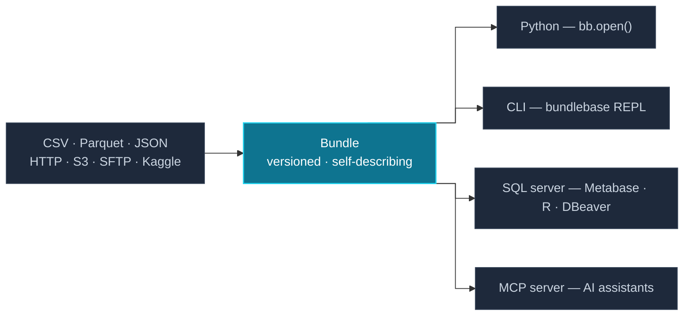

Your team wants the data you've been cleaning. Email a CSV? Stale by Friday. Run the pipeline yourself? Every time. Stand up a database? That's a quarter of work.

Bundlebase packages data into a versioned, self-describing container. Point anyone at the path — they get the data, the schema, the transformation history, and the provenance. Query with SQL, pull into pandas, connect Metabase. No server, no README, no repeating yourself.

## Share a dataset

=== "Python"

    ```python
    import bundlebase.sync as bb

    bundle = (bb.create("s3://company-data/sales-q1")
        .attach("exports/jan.csv")
        .attach("exports/feb.csv")
        .drop_column("ssn")
        .filter("status = 'closed_won'")
        .set_name("Q1 Sales — Closed Won"))
    bundle.commit("Initial Q1 export")

    # Anyone with the path
    bundle = bb.open("s3://company-data/sales-q1")
    df = bundle.to_pandas()
    ```

=== "SQL"

    ```sql
    ATTACH 'exports/jan.csv';
    ATTACH 'exports/feb.csv';
    DROP COLUMN ssn;
    FILTER WITH SELECT * FROM bundle WHERE status = 'closed_won';
    SET NAME 'Q1 Sales — Closed Won';
    COMMIT 'Initial Q1 export';

    -- Anyone with the path
    OPEN 's3://company-data/sales-q1';
    SELECT region, SUM(amount) FROM bundle GROUP BY region;
    ```

Commit once. Share the path. The consumer gets a DataFrame, a SQL connection, or a CLI session — their choice. The commit history *is* the changelog. No "which file is the latest?" conversations.

[What makes a bundle different from a Parquet file →](getting-started/why-bundlebase.md)

## Durable storage for LLM agents

Agents lose context between sessions. A bundle doesn't. At startup the agent reads `name`, `num_rows`, `schema`, and `history()` — it knows exactly what it has without re-fetching anything. Crash mid-run? Next session opens the last committed state, clean.

=== "Python"

    ```python
    # New session — reconstruct from the bundle itself
    bundle = bb.open("s3://agent-workspace/product-reviews")
    print(bundle.name)      # "Product Reviews"
    print(bundle.num_rows)  # 14,302
    for e in bundle.history():
        print(e)            # what ran and when

    results = bundle.query(
        "SELECT * FROM bundle WHERE review_date >= '2026-01-01'"
    ).to_pandas()
    ```

=== "SQL / MCP"

    ```sql
    -- REPL: new session
    OPEN 's3://agent-workspace/product-reviews';
    SHOW STATUS;    -- name, rows, version
    SHOW HISTORY;   -- full commit log

    SELECT * FROM bundle WHERE review_date >= '2026-01-01';
    ```

    Or expose as an MCP tool server — the agent gets `query`, `schema`,
    `history`, and `sample` as native tools, no code required:

    ```bash
    bundlebase mcp --bundle s3://agent-workspace/product-reviews
    ```

[See the agent use case →](getting-started/why-bundlebase.md#use-case-2-data-storage-for-llm-agents)

## Data hygiene rules that travel with the bundle

Your source data is dirty. You clean it every time — until you forget. `always_delete` and `always_update` encode cleanup rules into the bundle itself. They fire on every future attach, regardless of who runs it.

=== "Python"

    ```python
    bundle = bb.create("s3://analytics/crm-export")

    # Define once
    bundle.always_delete("WHERE amount < 0")
    bundle.always_delete("WHERE status = 'test'")

    # Attach dirty data — rules fire automatically
    bundle.attach("jan.csv").commit("January")
    bundle.extend().attach("feb.csv").commit("February")
    ```

=== "SQL"

    ```sql
    OPEN 's3://analytics/crm-export';
    ALWAYS DELETE WHERE amount < 0;
    ALWAYS DELETE WHERE status = 'test';

    -- attach dirty data — rules fire automatically
    ATTACH 'jan.csv';
    COMMIT 'January';
    ```

No shared cleanup script. No "oops, I forgot the filter" incidents.

[See the ETL use case →](getting-started/why-bundlebase.md#persistent-pipeline-rules)

## How it works



## Works with your stack

| | |
|---|---|
| **Python** | `pandas` · `polars` · `numpy` · `pyarrow`, sync + async |
| **CLI** | Interactive REPL, scriptable commands — no Python required |
| **BI tools** | Metabase · DBeaver · R · Julia · Go — anything with an Arrow Flight driver or native Arrow Flight support |
| **Storage** | S3 · GCS · Azure Blob · local paths |
| **Formats** | Parquet · CSV · JSON — mixed sources union automatically |
| **Custom connectors** | Pull from any source — Salesforce, internal APIs, custom databases — by writing a connector in Python, Go, Java, or any IPC-compatible language |
| **Custom SQL functions** | Register Python callables as scalar or aggregate UDFs and call them directly in SQL queries |
| **SQL** | Full Apache DataFusion syntax — `SELECT * FROM bundle WHERE ...` |
| **Scale** | Streaming execution — datasets larger than RAM, constant memory |
| **Core** | Rust + Apache Arrow — columnar, fast |

## Get started

1. [Why Bundlebase?](getting-started/why-bundlebase.md) — comparisons to DVC, Delta Lake, plain files, databases
2. [Python](getting-started/python/install.md) — pip install, then build your first bundle
3. [CLI](getting-started/cli/install.md) — download the binary, query interactively
